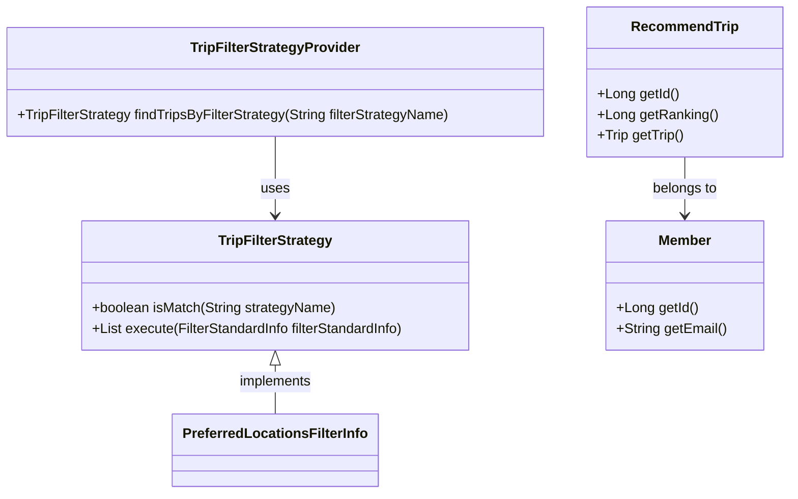
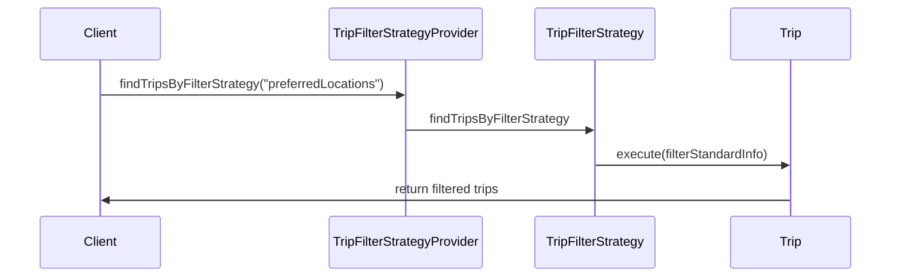
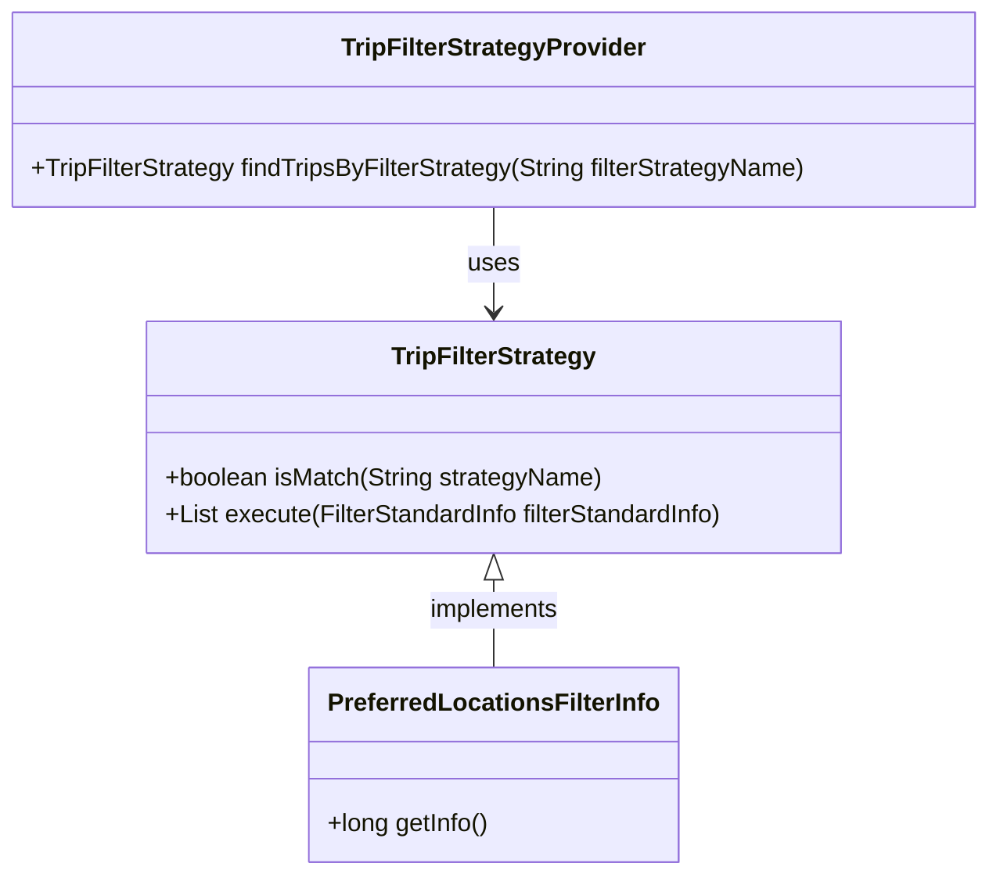

# Comprehensive Documentation for the Codebase

## 1. Overall Structure

### High-Level Overview
The codebase is structured into several packages, each serving a specific domain within the application. The main packages include:

- **moheng.keyword**: Contains classes related to keywords associated with trips.
- **moheng.member**: Manages member-related functionalities, including member data and repository interfaces.
- **moheng.recommendtrip**: Handles the recommendation of trips based on various strategies.
- **moheng.trip**: Contains classes related to trip management and data retrieval.

### Purpose and Function of Each File/Module

- **TripKeywordRepository**: A repository interface for managing `TripKeyword` entities, providing methods to find keywords associated with trips based on various criteria.
  
- **Member**: Represents a member entity with attributes such as email, nickname, profile image, and social type. It includes validation methods for member data.

- **MemberRepository**: A repository interface for managing `Member` entities, providing methods to find members by email and check for existing members.

- **NoExistMemberException**: A custom exception thrown when a member does not exist.

- **RecommendTrip**: Represents a recommended trip entity, linking a member to a trip with a ranking.

- **PreferredLocationsFilterInfo**: A filter info class used to encapsulate member-specific filtering criteria.

- **TripFilterStrategy**: An interface defining the strategy for filtering trips based on specific criteria.

- **TripFilterStrategyProvider**: A provider class that manages and retrieves the appropriate trip filter strategy based on the strategy name.

- **RecommendTripRepository**: A repository interface for managing `RecommendTrip` entities, providing methods to find recommendations by member and manage rankings.

- **RecommendTripCreateRequest**: A DTO for creating a new recommended trip.

- **TripRepository**: A repository interface for managing `Trip` entities, providing various methods to retrieve trips based on different criteria.

- **FindTripsResponse**: A DTO that encapsulates the response for finding trips, including the associated keywords.

- **NoExistTripException**: A custom exception thrown when a trip does not exist.

### Interaction Between Components
The components interact primarily through repository interfaces and entity classes. For example, `Member` interacts with `MemberRepository` to perform CRUD operations, while `RecommendTrip` interacts with `RecommendTripRepository` to manage recommendations. The strategy pattern is implemented in the `TripFilterStrategy` interface and its implementations, allowing for flexible filtering of trips based on different criteria.

### Mermaid Diagrams

## 2. Strategy Pattern Implementation

### Strategy Pattern Overview
The strategy pattern is implemented through the `TripFilterStrategy` interface and its concrete implementations. This allows for dynamic selection of filtering strategies at runtime based on the provided strategy name.

### Strategy Interface and Concrete Strategy Classes
- **TripFilterStrategy**: This interface defines the methods that all concrete strategies must implement:
  - `boolean isMatch(final String strategyName)`: Checks if the strategy matches the given name.
  - `List<Trip> execute(final FilterStandardInfo filterStandardInfo)`: Executes the filtering logic based on the provided filter information.

### Context Class
- **TripFilterStrategyProvider**: This class acts as the context that uses the strategies. It holds a list of available strategies and provides a method to find the appropriate strategy based on the name.

### Class Diagram

## 3. Detailed Component Documentation

### a. Classes

#### TripKeywordRepository
- **Purpose**: Repository interface for managing `TripKeyword` entities.
- **Attributes**: None (interface).
- **Role**: Provides methods to retrieve trip keywords based on various criteria.
- **Relationships**: Extends `JpaRepository`.

#### Member
- **Purpose**: Represents a member entity.
- **Attributes**:
  - `Long id`: Unique identifier for the member.
  - `String email`: Email address of the member.
  - `String nickName`: Nickname of the member.
  - `String profileImageUrl`: URL of the member's profile image.
  - `SocialType socialType`: Type of social login used by the member.
  - `LocalDate birthday`: Birthday of the member.
  - `GenderType genderType`: Gender of the member.
  - `Authority authority`: Authority level of the member.
- **Role**: Manages member data and validation.
- **Relationships**: Inherits from `BaseEntity`.

#### MemberRepository
- **Purpose**: Repository interface for managing `Member` entities.
- **Attributes**: None (interface).
- **Role**: Provides methods to find members by email and check for existing members.
- **Relationships**: Extends `JpaRepository`.

#### NoExistMemberException
- **Purpose**: Custom exception for non-existent members.
- **Attributes**: None.
- **Role**: Provides error handling for member-related operations.

#### RecommendTrip
- **Purpose**: Represents a recommended trip entity.
- **Attributes**:
  - `Long id`: Unique identifier for the recommendation.
  - `Member member`: The member associated with the recommendation.
  - `Trip trip`: The trip being recommended.
  - `Long ranking`: Ranking of the recommendation.
- **Role**: Manages the relationship between members and their recommended trips.
- **Relationships**: Many-to-one relationship with `Member` and `Trip`.

#### PreferredLocationsFilterInfo
- **Purpose**: Encapsulates filtering criteria for preferred locations.
- **Attributes**:
  - `Long memberId`: ID of the member for filtering.
- **Role**: Provides member-specific filtering information.

#### TripFilterStrategy
- **Purpose**: Interface for trip filtering strategies.
- **Attributes**: None (interface).
- **Role**: Defines methods for filtering trips based on criteria.
- **Relationships**: Implemented by various concrete strategy classes.

#### TripFilterStrategyProvider
- **Purpose**: Provides access to trip filtering strategies.
- **Attributes**:
  - `List<TripFilterStrategy> tripFilterStrategies`: List of available strategies.
- **Role**: Manages and retrieves strategies based on names.

#### RecommendTripRepository
- **Purpose**: Repository interface for managing `RecommendTrip` entities.
- **Attributes**: None (interface).
- **Role**: Provides methods to find recommendations and manage rankings.
- **Relationships**: Extends `JpaRepository`.

#### RecommendTripCreateRequest
- **Purpose**: DTO for creating a new recommended trip.
- **Attributes**:
  - `Long tripId`: ID of the trip to be recommended.
- **Role**: Encapsulates data for creating recommendations.

#### TripRepository
- **Purpose**: Repository interface for managing `Trip` entities.
- **Attributes**: None (interface).
- **Role**: Provides methods to retrieve trips based on various criteria.
- **Relationships**: Extends `JpaRepository`.

#### FindTripsResponse
- **Purpose**: DTO for finding trips and their associated keywords.
- **Attributes**:
  - `List<FindTripResponse> findTripResponses`: List of responses containing trip data.
- **Role**: Encapsulates the response for trip searches.

#### NoExistTripException
- **Purpose**: Custom exception for non-existent trips.
- **Attributes**: None.
- **Role**: Provides error handling for trip-related operations.

### b. Methods and Functions

#### TripKeywordRepository Methods
- **findTripKeywordsByKeywordIds**
  - **Purpose**: Retrieves trip keywords by keyword IDs.
  - **Parameters**: 
    - `List<Long> keywordIds`: List of keyword IDs.
  - **Return Value**: `List<TripKeyword>`: List of trip keywords.
  
- **findTop30ByKeywordId**
  - **Purpose**: Retrieves the top 30 trip keywords by keyword ID.
  - **Parameters**: 
    - `Long keywordId`: ID of the keyword.
  - **Return Value**: `List<TripKeyword>`: List of top trip keywords.

- **findByTripIn**
  - **Purpose**: Retrieves trip keywords for a list of trips.
  - **Parameters**: 
    - `List<Trip> trips`: List of trips.
  - **Return Value**: `List<TripKeyword>`: List of trip keywords.

- **findByTrips**
  - **Purpose**: Retrieves trip keywords for a list of trips using a query.
  - **Parameters**: 
    - `List<Trip> trips`: List of trips.
  - **Return Value**: `List<TripKeyword>`: List of trip keywords.

- **findByTrip**
  - **Purpose**: Retrieves trip keywords for a specific trip.
  - **Parameters**: 
    - `Trip trip`: The trip to find keywords for.
  - **Return Value**: `List<TripKeyword>`: List of trip keywords.

#### Member Methods
- **changePrivilege**
  - **Purpose**: Changes the authority level of the member.
  - **Parameters**: 
    - `Authority authority`: New authority level.
  - **Return Value**: None.

- **isNicknameChanged**
  - **Purpose**: Checks if the nickname has changed.
  - **Parameters**: 
    - `String inputNickname`: The new nickname to compare.
  - **Return Value**: `boolean`: True if the nickname has changed.

#### RecommendTrip Methods
- **getId**
  - **Purpose**: Retrieves the ID of the recommendation.
  - **Return Value**: `Long`: ID of the recommendation.

- **getRanking**
  - **Purpose**: Retrieves the ranking of the recommendation.
  - **Return Value**: `Long`: Ranking of the recommendation.

- **getTrip**
  - **Purpose**: Retrieves the trip associated with the recommendation.
  - **Return Value**: `Trip`: The recommended trip.

#### TripFilterStrategy Methods
- **isMatch**
  - **Purpose**: Checks if the strategy matches the given name.
  - **Parameters**: 
    - `String strategyName`: Name of the strategy.
  - **Return Value**: `boolean`: True if it matches.

- **execute**
  - **Purpose**: Executes the filtering logic.
  - **Parameters**: 
    - `FilterStandardInfo filterStandardInfo`: Information for filtering.
  - **Return Value**: `List<Trip>`: List of filtered trips.

### c. Important Variables

#### Global Variables
- **EMAIL_FORMAT** (in `Member` class)
  - **Purpose**: Regex pattern for validating email format.
  - **Type**: `Pattern`.

- **MAX_NICK_NAME_LENGTH** (in `Member` class)
  - **Purpose**: Maximum allowed length for nicknames.
  - **Type**: `int`.

- **MIN_NICK_NAME_LENGTH** (in `Member` class)
  - **Purpose**: Minimum required length for nicknames.
  - **Type**: `int`.

## 4. Implementation Flow

### Sequence Diagram

### Explanation of the Flow
1. The client requests a trip filtering strategy from the `TripFilterStrategyProvider` by providing a strategy name.
2. The `TripFilterStrategyProvider` searches for the appropriate strategy that matches the provided name.
3. Once found, the strategy's `execute` method is called with the relevant filter information.
4. The strategy processes the filtering logic and returns a list of filtered trips to the client.

This documentation provides a comprehensive overview of the codebase, detailing its structure, components, and interactions, making it easier for developers to understand and work with the system.
