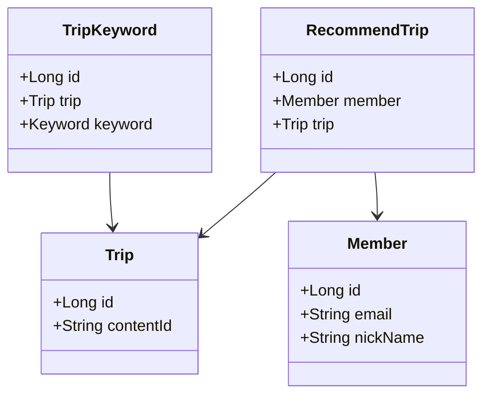
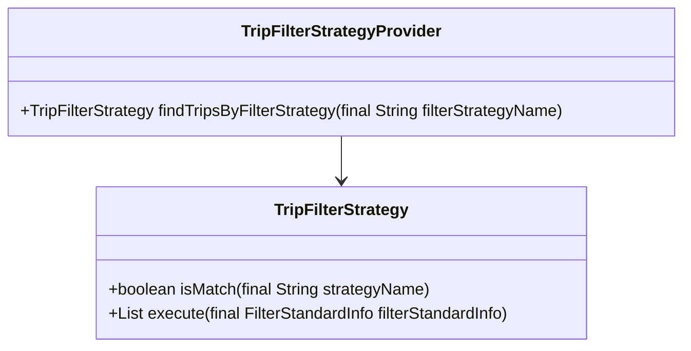
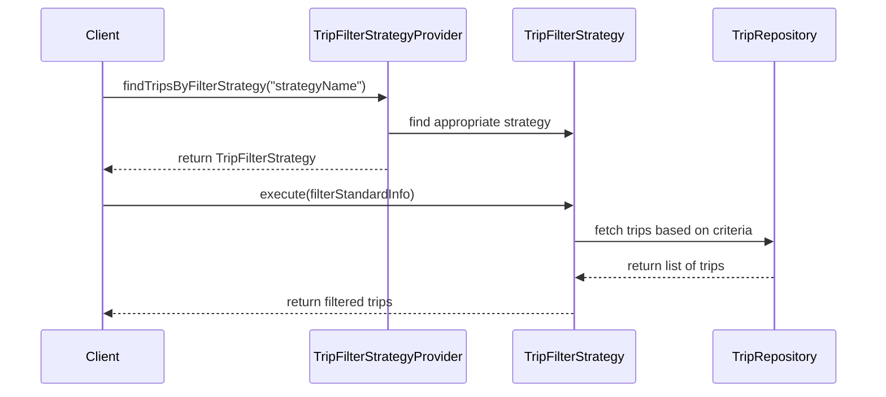

# Comprehensive Documentation for the Codebase

## 1. Overall Structure

### High-Level Overview
The codebase is structured around a travel recommendation system, which includes various domain entities, repositories, and services. The main components are organized into packages that represent different domains such as `keyword`, `member`, `recommendtrip`, and `trip`. Each package contains domain models, repositories for data access, and exception handling.

### Purpose and Function of Each File/Module
- **Domain Models**: Represent the core entities of the application.
  - `TripKeyword`: Represents keywords associated with trips.
  - `Member`: Represents a user/member of the system.
  - `RecommendTrip`: Represents a recommended trip for a member.
  
- **Repositories**: Interfaces for data access using Spring Data JPA.
  - `TripKeywordRepository`: Provides methods to access `TripKeyword` data.
  - `MemberRepository`: Provides methods to access `Member` data.
  - `RecommendTripRepository`: Provides methods to access `RecommendTrip` data.
  - `TripRepository`: Provides methods to access `Trip` data.

- **DTOs**: Data Transfer Objects for transferring data between layers.
  - `RecommendTripCreateRequest`: Represents a request to create a recommended trip.
  - `FindTripsResponse`: Represents the response containing found trips.

- **Exceptions**: Custom exceptions for error handling.
  - `NoExistMemberException`: Thrown when a member does not exist.
  - `NoExistTripException`: Thrown when a trip does not exist.

- **Filter Strategies**: Interfaces and implementations for filtering trips based on various criteria.
  - `TripFilterStrategy`: Interface for defining filtering strategies.
  - `TripFilterStrategyProvider`: Provides the appropriate filtering strategy based on the name.

### Interaction Between Components
The components interact through repositories for data access, domain models for business logic, and DTOs for data transfer. The filter strategies are used to apply different filtering logic when retrieving trips based on user preferences.

### Class Relationships Diagram

## 2. Strategy Pattern Implementation

### Strategy Pattern Overview
The strategy pattern is implemented to allow dynamic selection of filtering strategies for trips based on user preferences. This enables the application to apply different filtering logic without modifying the core logic of the application.

### Strategy Interface and Concrete Strategy Classes
- **Strategy Interface**: 
  - `TripFilterStrategy`: Defines the contract for filtering strategies.
    - `boolean isMatch(final String strategyName)`: Checks if the strategy matches the given name.
    - `List<Trip> execute(final FilterStandardInfo filterStandardInfo)`: Executes the filtering logic.

- **Concrete Strategy Classes**: (Not provided in the code, but expected to implement `TripFilterStrategy`)

### Context Class
- **TripFilterStrategyProvider**: Acts as the context that uses the strategies.
  - It holds a list of strategies and provides a method to find the appropriate strategy based on the name.

### Class Diagram for Strategy Pattern

## 3. Detailed Component Documentation

### a. Classes

#### TripKeyword
- **Purpose**: Represents keywords associated with trips.
- **Attributes**:
  - `Long id`: Unique identifier for the trip keyword.
  - `Trip trip`: The trip associated with this keyword.
  - `Keyword keyword`: The keyword entity.
- **Role**: Links trips with keywords for search and recommendation purposes.
- **Relationships**: 
  - Aggregates `Trip` and `Keyword`.

#### Member
- **Purpose**: Represents a user/member of the system.
- **Attributes**:
  - `Long id`: Unique identifier for the member.
  - `String email`: Email of the member.
  - `String nickName`: Nickname of the member.
  - `SocialType socialType`: Type of social login used by the member.
  - `LocalDate birthday`: Birthday of the member.
  - `GenderType genderType`: Gender of the member.
  - `Authority authority`: Authority level of the member.
- **Role**: Manages member information and validation.
- **Relationships**: 
  - Inherits from `BaseEntity`.

#### RecommendTrip
- **Purpose**: Represents a recommended trip for a member.
- **Attributes**:
  - `Long id`: Unique identifier for the recommended trip.
  - `Member member`: The member associated with this recommendation.
  - `Trip trip`: The trip being recommended.
  - `Long ranking`: Ranking of the recommendation.
- **Role**: Stores recommendations for members based on their preferences.
- **Relationships**: 
  - Aggregates `Member` and `Trip`.

#### TripFilterStrategyProvider
- **Purpose**: Provides the appropriate filtering strategy based on the name.
- **Attributes**:
  - `List<TripFilterStrategy> tripFilterStrategies`: List of available filtering strategies.
- **Role**: Acts as a context for selecting and executing filtering strategies.
- **Relationships**: 
  - Uses `TripFilterStrategy`.

### b. Methods and Functions

#### TripKeywordRepository
- **Method**: `List<TripKeyword> findTripKeywordsByKeywordIds(@Param("keywordIds") final List<Long> keywordIds)`
  - **Purpose**: Finds trip keywords by a list of keyword IDs.
  - **Parameters**: 
    - `keywordIds`: List of keyword IDs to search for.
  - **Return Value**: List of `TripKeyword` objects.
  
#### Member
- **Method**: `void changePrivilege(final Authority authority)`
  - **Purpose**: Changes the authority level of the member.
  - **Parameters**: 
    - `authority`: New authority level to set.
  - **Return Value**: None.
  
#### RecommendTripRepository
- **Method**: `List<RecommendTrip> findAllByMemberId(final Long memberId)`
  - **Purpose**: Finds all recommended trips for a specific member.
  - **Parameters**: 
    - `memberId`: ID of the member.
  - **Return Value**: List of `RecommendTrip` objects.

### c. Important Variables

#### Global Variables
- **EMAIL_FORMAT**: 
  - **Purpose**: Regex pattern for validating email formats.
  - **Type**: `Pattern`.
  
- **MAX_NICK_NAME_LENGTH**: 
  - **Purpose**: Maximum allowed length for nicknames.
  - **Type**: `int`.

- **MIN_NICK_NAME_LENGTH**: 
  - **Purpose**: Minimum allowed length for nicknames.
  - **Type**: `int`.

## 4. Implementation Flow

### Sequence Diagram

This documentation provides a comprehensive overview of the codebase, detailing its structure, strategy pattern implementation, and specific components. It serves as a guide for both new and experienced developers to understand and work with the code effectively.
