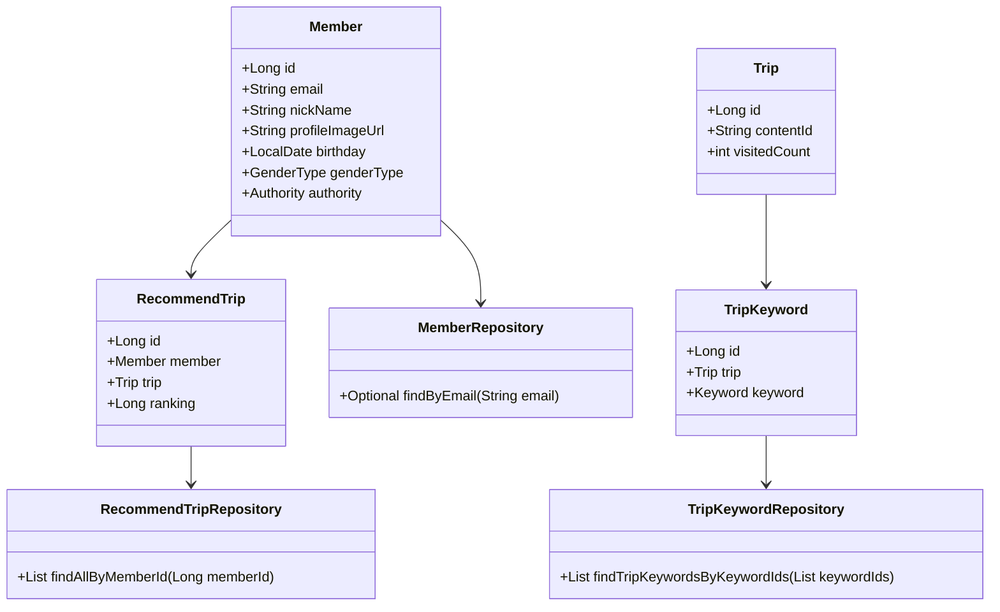
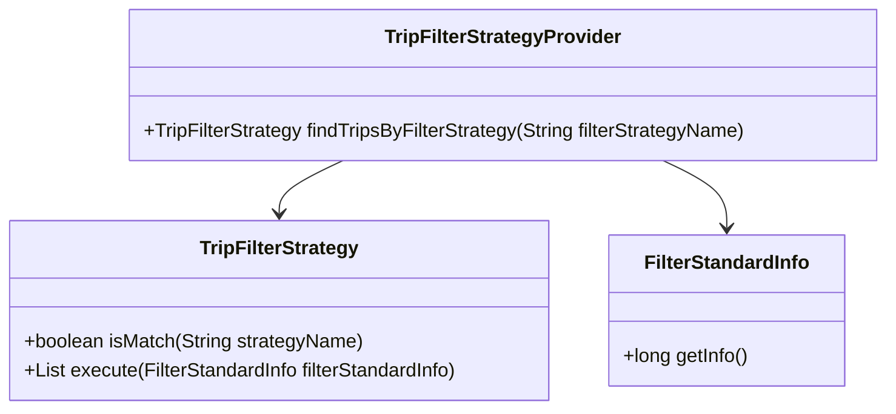
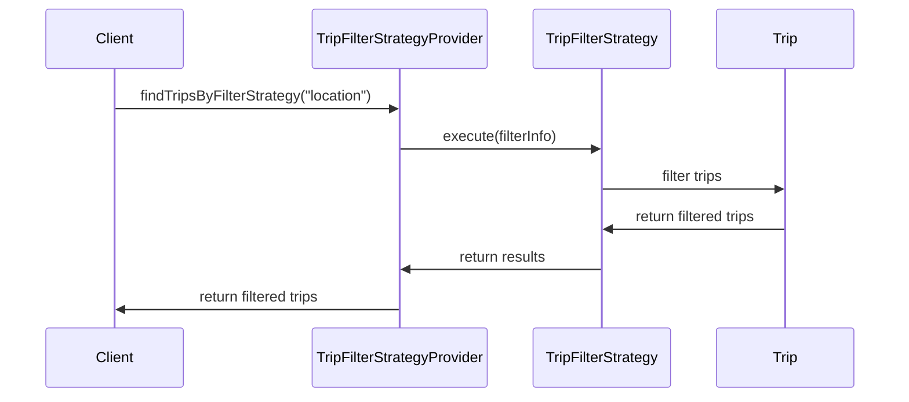

# Comprehensive Documentation for the Codebase

## 1. Overall Structure

### High-Level Overview
The codebase is structured around a domain-driven design, focusing on various entities related to a travel application. The main components include repositories for data access, domain models representing the core business logic, and exception handling for error management. The primary entities include `Member`, `Trip`, `RecommendTrip`, and `TripKeyword`, each with its respective repository for database interactions.

### Purpose and Function of Service
The service layer is responsible for orchestrating the business logic and interactions between the repositories and the controllers. It acts as a mediator that processes requests, applies business rules, and returns responses. The service layer ensures that the application adheres to the principles of separation of concerns and single responsibility.

### Interaction Between Components
- **Repositories**: Interfaces that extend `JpaRepository` to provide CRUD operations for entities.
- **Entities**: Represent the core business objects (e.g., `Member`, `Trip`, `RecommendTrip`).
- **DTOs**: Data Transfer Objects (e.g., `FindTripsResponse`, `RecommendTripCreateRequest`) that facilitate data exchange between layers.
- **Exceptions**: Custom exceptions (e.g., `NoExistMemberException`, `NoExistTripException`) that handle specific error scenarios.

### Class Relationships


## 2. Strategy Pattern Implementation

### Strategy Pattern Overview
The strategy pattern is implemented to allow dynamic selection of filtering strategies for trips based on different criteria. This design enables the application to support multiple filtering strategies without modifying the core logic.

### Strategy Interface and Concrete Strategy Classes
- **Strategy Interface**: `TripFilterStrategy`
  - Method `isMatch(String strategyName)`: Checks if the strategy matches the provided name.
  - Method `execute(FilterStandardInfo filterStandardInfo)`: Executes the filtering logic based on the provided information.

- **Concrete Strategy Classes**: Implementations of `TripFilterStrategy` that define specific filtering logic (not provided in the code snippet).

### Context Class
- **TripFilterStrategyProvider**: This class acts as a context that holds a list of strategies and provides a method to find and return the appropriate strategy based on the name.

### Class Diagram for Strategy Pattern


## 3. Detailed Component Documentation

### a. Classes

#### 1. Class: `TripKeywordRepository`
- **Purpose**: Interface for accessing `TripKeyword` entities from the database.
- **Attributes**: None (inherited from `JpaRepository`).
- **Role**: Provides methods to query trip keywords based on various criteria.
- **Relationships**: Extends `JpaRepository<TripKeyword, Long>`.

#### 2. Class: `Member`
- **Purpose**: Represents a user/member in the system.
- **Attributes**:
  - `Long id`: Unique identifier.
  - `String email`: Email address (unique).
  - `String nickName`: User's nickname.
  - `String profileImageUrl`: URL of the user's profile image.
  - `SocialType socialType`: Type of social login.
  - `LocalDate birthday`: User's birthday.
  - `GenderType genderType`: User's gender.
  - `Authority authority`: User's authority level.
- **Role**: Encapsulates member-related data and validation logic.
- **Relationships**: Inherits from `BaseEntity`.

#### 3. Class: `RecommendTrip`
- **Purpose**: Represents a recommended trip for a member.
- **Attributes**:
  - `Long id`: Unique identifier.
  - `Member member`: The member associated with the recommendation.
  - `Trip trip`: The trip being recommended.
  - `Long ranking`: Ranking of the recommendation.
- **Role**: Holds data related to trip recommendations.
- **Relationships**: Many-to-one relationship with `Member` and `Trip`.

### b. Methods and Functions

#### Method: `findTripKeywordsByKeywordIds`
- **Purpose**: Retrieves a list of `TripKeyword` entities based on keyword IDs.
- **Parameters**:
  - `List<Long> keywordIds`: List of keyword IDs to filter by.
- **Return Value**: `List<TripKeyword>` - List of matching trip keywords.
- **Side Effects**: None.
- **Example Usage**:
  ```java
  List<TripKeyword> keywords = tripKeywordRepository.findTripKeywordsByKeywordIds(Arrays.asList(1L, 2L, 3L));
  ```

#### Method: `validateEmail`
- **Purpose**: Validates the format of the provided email.
- **Parameters**:
  - `String email`: Email to validate.
- **Return Value**: None (throws exception if invalid).
- **Side Effects**: Throws `InvalidEmailFormatException` if the email format is incorrect.
- **Example Usage**:
  ```java
  member.validateEmail("test@example.com");
  ```

## 4. Implementation Flow

### Sequence Diagram


This documentation provides a comprehensive overview of the codebase, detailing its structure, design patterns, and individual components. It serves as a guide for both new and experienced developers to understand and work with the code effectively.
